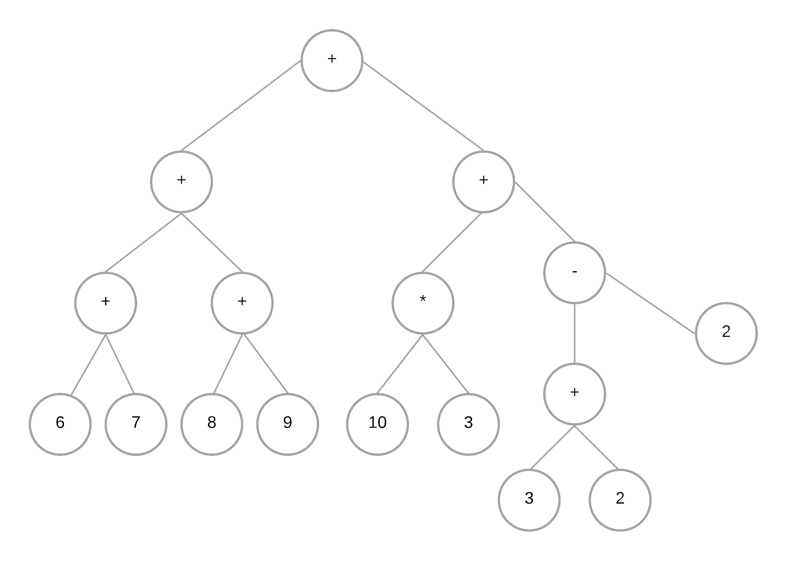

[Volver](../README.md)

# Operaciones Matemáticas en PreOrden y PostOrden
---
## Tarea 1

### 3 + 6 + 2 * 3 + 2 * 5

#### PreOrden: +++36+6*32*25

|  | 2 |  |  |  |  |  |
| --- | --- | --- | --- | --- | --- | --- |
|  | 3 |  |  |  |  |  |
|  | * | 6 |  |  |  |  |
| 6 | 6 | 6 |  | 5 |  |  |
| 3 | + | + | 12 | 2 |  |  |
| + | 9 | 9 | 9 | * | 10 |  |
| + | + | + | + | 21 | 21 |  |
| + | + | + | + | + | + | 31 |

#### PostOrden: 36+6+23*+25*+ 

|  |  | * |  | * |  |  |
| --- | --- | --- | --- | --- | --- | --- |
| + | + | 3 | + | 5 | + |  |
| 3 | 6 | 2 | 6 | 2 | 10 |  |
| 6 | 9 | 15 | 15 | 21 | 21 | **31** |

---

## Tarea 2

### 6 + 7 + 8 + 9 + 10 * 3 + 3 + 2 - 2

#### PreOrden: +++67+89+*103-+322

|  |  |  |  | 2 |  |  |  |  |
| --- | --- | --- | --- | --- | --- | --- | --- | --- |
|  |  |  |  | 3 | 2 |  |  |  |
|  | 9 |  | 3 | + | 5 |  |  |  |
| 7 | 8 |  | 10 | - | - | 3 |  |  |
| 6 | + | 17 | * | 30 | 30 | 30 |  |  |
| + | 13 | 13 | + | + | + | + | 33 |  |
| + | + | + | 30 | 30 | 30 | 30 | 30 |  |
| + | + | + | + | + | + | + | + | 63 |

#### PostOrden: 67+89++103*32+2-++

|  |  |  |  | + | - |  |  |  |
| --- | --- | --- | --- | --- | --- | --- | --- | --- |
|  | + |  | * | 2 | 2 | + |  |  |
| + | 9 | + | 3 | 3 | 5 | 3 | + |  |
| 7 | 8 | 17 | 10 | 30 | 30 | 30 | 33 |  |
| 6 | 13 | 13 | 30 | 30 | 30 | 30 | 30 | 63 |

[Volver](../README.md)